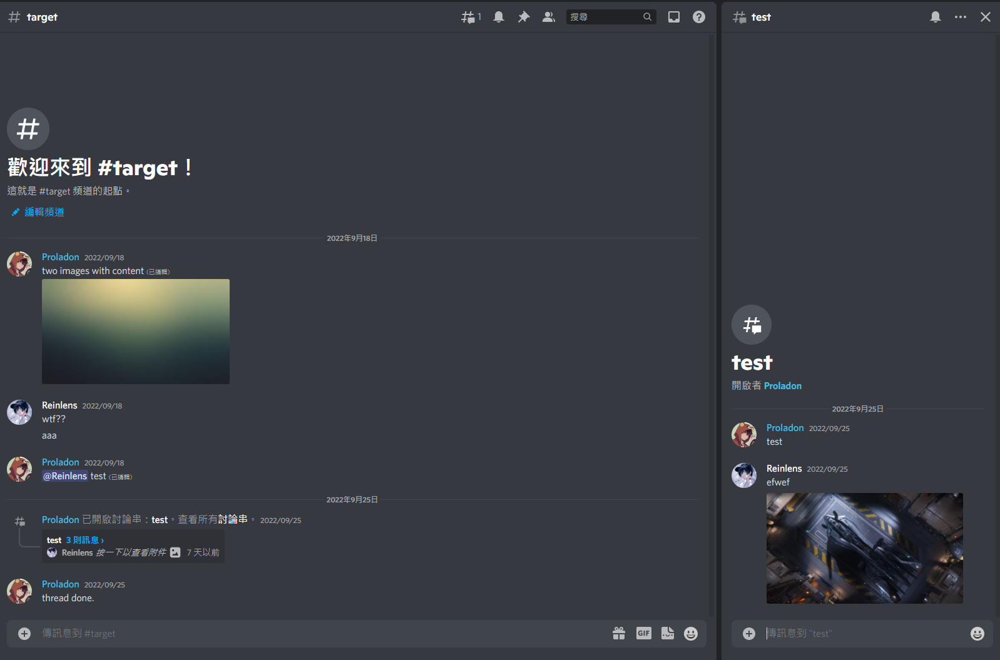
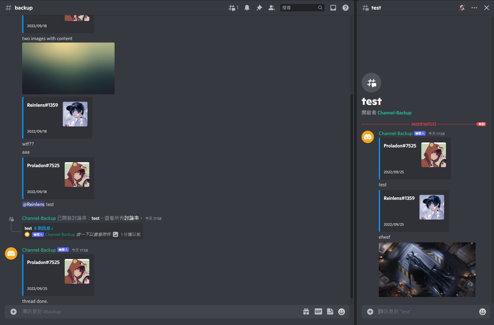

# Discord Channel Backup Bot

<table>
  <tr>
    <td valign="top">
        <p>Source</p>
            
    </td>
    <td valign="top">
        <p>Backup</p>
            
    </td>
  </tr>
</table>

## Why

Althought already has [DiscordChatExporter](https://github.com/Tyrrrz/DiscordChatExporter), but the problem of `DiscordChatExporter` is that you have to save all messages assets in your own disk or cloud drive, which need a lot of disk sapce. If you use `DiscordChatExporter` but not chose download all messages assets, and then you delete the source channel, all of these assets cdn link will be lost.

So if we wanna keep all assets and aslo no need own disk sapce, the way is resend all messages history into another channel to backup on the discord server. and this is what this bot doing.

## How it's works

### Step.1

Bot will fetch target channel all history messages, and save all messages id array json temp files to local temp folder

### Step.2

Recursive all temp files, find each message by id, and then deal it message by each.

if message have attachments:

1. save all attachments temp files to local temp folder
2. send messages content with attachments
3. delete attachments temp

if message not have attachments:

1. send messages content

> temp file will delete after each file messages done.

---

## Installation

1. ### Download or clone this repo
   - [Download this repo](https://github.com/Proladon/discord-channel-backup-bot/archive/refs/heads/main.zip)
   - Clone this repo

```
https://github.com/Proladon/discord-channel-backup-bot.git
```

2. ### Setting up bot

   - rename `.env.example` file to `.env`
   - give required values in `.env` file

3. ### Start the bot

- First install the project dependencies
  - excute terminal command `yarn` or `npm install`
- Start the Bot
  - excute terminal command `yarn bot` or `npm run bot`

## Bot Backup Command

### Slash Command: `backup <target> <dst>`

- `target`: target channel, which channel you wanna backup
- `dst`: dst `channel ID`, which channel you wanna backup to (can cross server, but also required bot had in server there)
